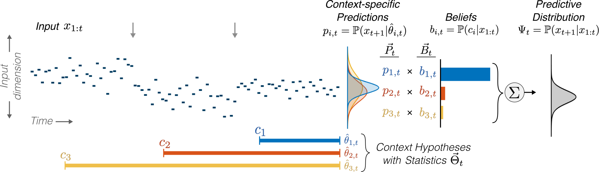

# D-REX Model

The Dynamic Regularity Extraction (D-REX) model is a computational model for predictive processing in auditory perception of sequential sounds. Based in Bayesian inference and theories of predictive coding, the model provides a framework for exploring the computational processes behind predictive coding in complex scenes.

Given a sequence of continuous-valued inputs along any acoustic or perceptual dimension (e.g., pitch, energy), the model produces a prediction at each time given the observed inputs.

This probabilistic prediction is based on a statistical representation of structure (i.e., _regularities_) in the observed sequence. Importantly, the model does not assume stationarity in the input (hence, _dynamic_); rather, the model collects many statistical representations over different context windows (termed _context hypotheses_). These contexts are then weighted by beliefs, or evidence for each context window from the observed sequence. Here is an illustration of how the model builds these robust predictions (taken from [[1]](#related-publications)):
<br/><br/><br/>



<!-- GETTING STARTED -->
## Getting Started

Model code is written in MATLAB. Code was tested using MATLAB R2019b but should be compatible with other versions. 

To obtain a local copy of the code:
```
git clone https://github.com/JHU-LCAP/drex-model.git
```

Add code directory to MATLAB path.


<!-- USAGE EXAMPLES -->
## Usage

```output = run_DREX_model(input, params);```

The included MATLAB script, _examples.m_, contains examples of model usage. 

There are three main steps for using the D-REX model:

#### 1. Define Input 

The input to the model is a vector of continous-valued observations. If you wish to apply the D-REX model to an acoustic waveform, a preprocessing step is necessary to extract the input sequence from the acoustic waveform. See [[1]](#related-publications) for examples of applying the model to real-world audio along various dimensions.

Exception to the above: if modeling a temporal process (e.g., timing of transient onsets, neural spiking), the input is a binary signal with 1's and 0's indicating the presence or absence of an event, respectively.

#### 2. Set Parameters

The following parameters can be used to manipulate the internal statistical representation, the prior knowledge, and resource constraints in the model: 

* The _distribution_ sets the form of the predictive distribution and the statistical estimates collected from the input. The following distrubutions are currently supported: Guassian, Gaussian mixture, Log-normal, and Poisson. For Gaussian and Log-normal distributions, the dependence parameter _D_ additionally sets the extent of temporal dependence (i.e., covariance) of the distribution. For the Poisson distribution, the parameter _D_ sets the interval into the past used to calculate event-rate.

* The _prior_ represents prior knowledge about the distribution of the input observations. It takes the same form as the sufficient statistics, and therefore depends on the distribution. The included MATLAB-function _estimate_suffstat.m_ can be used to compute the prior statistics from an input sequence for a given distribution (and D). This can also be used to obtain the proper form of the prior to be set manually. For example:
```matlab
>> x = randn(100,1);  % input
>> params = []; 
>> params.distribution = 'gaussian';  % set distribution
>> params.D = 2; 
>> prior = estimate_suffstat(x,params)  % statistics in 'prior' structure can be set manually 
```

* The _hazard_, or hazard rate, parameter is the model's expectation of a change in the underlying statistics of the input, representing the assumed volatility in the sequence before it is observed. This parameter can be a scalar or vector, representing constant and time-varying hazard, respectively. If the hazard rate is lower, the model puts more weight on longer-context statistics, adapting slower to changing statistics; if the hazard rate is higher, the converse is true.

* The _obsnz_, or observation noise, parameter represents perceptual fidelity along the input dimension. It is equivalent to adding independent Gaussian noise with variance _obsnz_ to the input sequence.

* The _memory_ parameter represents finite working memory constraints. It sets an upper bound on the context window, thereby limiting the sample size of observed inputs used to estimate statistics. For very long input sequences, the _memory_ parameter can be used to make the model more efficient.

* The _maxhyp_, or maximum hypotheses, parameter is an optional parameter that can also be used to make the model more efficient for processing very long inputs. It prunes the context hypotheses by beliefs when the number of context hypotheses exceeds _maxhyp_. 

All parameters are set as fields in a single structure and passed as input to _run_DREX_model.m_. Default values can be found in the comments at the top of the model code; additional description can be found in [[1]](#related-publications).

#### 3. Interpret Output

The main function _run_DREX_model.m_ returns a structure with three fields containing the outputs of the model:

* _Surprisal_ is a probabilistic measure of prediction error of each observation in the input sequence. High surprisal correponds to a low predictive probability, and zero surprisal corresponds to a prediction with certain (i.e., probability 1).

* _Beliefs_, or context beliefs, contain the weights on each context hypothesis over time.

* _Prediction_params_ contains the parameters of the predictive distribution for each context hypothesis as they evolved over time. In conjunction with the beliefs, this can be used to reconstruct the predictive distribution at each time.

These three outputs can be visualized with the included function _display_DREX_output.m_, for example:
```matlab
out = run_DREX_model(in,params);
display_DREX_output(out,in);
```
Importantly, all outputs are causal. See [[1]](#related-publications) for additional description.

<br/>
Outputs can be used as-is or they can be interpreted further depending on the application or experimental paradigm to relate the model to behavioral or neural responses. Several functions were included to interpret these outputs:

* _post_DREX_prediction.m_ can be used to reconstruct the predictive distribution

* _post_DREX_changedecision.m_ can be used to apply the model to a change decision paradigm, where a single change in underlying statistics is detected. An input threshold is applied to a probability of change derived from the beliefs. 

* _post_DREX_beliefdynamics.m_ outputs a measure of the shift in beliefs at each time. It can be used to measure how much the model re-weights the context hypotheses after observing each input.

<!-- PUBLICATIONS -->
## Related publications

1. Skerritt-Davis, B. & Elhilali, M. Computational framework for predictive processing of complex sound sequences. _Under review._

1. Skerritt-Davis, B. & Elhilali, M. Neural encoding of auditory statistics. _Under review._

1. Kothinti, S., Skerritt-Davis, B., Nair, A. & Elhilali, M. [Synthesizing Engaging Music Using Dynamic Models of Statistical Surprisal.](https://ieeexplore.ieee.org/document/9054500) In _ICASSP 2020 - 2020 IEEE International Conference on Acoustics, Speech and Signal Processing (ICASSP)_, pages 761-765, IEEE, 2020.

1. Skerritt-Davis, B. & Elhilali, M. [A Model for Statistical Regularity Extraction from Dynamic Sounds.](http://dx.doi.org/10.3813/AAA.919279) _Acta Acustica united with Acustica_, 105(1):1-4, 2019.

1. Skerritt-Davis, B. & Elhilali, M. [Detecting change in stochastic sound sequences.](http://dx.doi.org/10.1371/journal.pcbi.1006162) _PLOS Computational Biology_, 14(5):e1006162, 2018.

<!-- LICENSE -->
## Citation

If using this model in a publication, please cite as follows:

TBD


<!-- CONTACT -->
## Contact

Ben Skerritt-Davis - bsd@jhu.edu

Mounya Elhilali - mounya@jhu.edu

Project Link: [https://github.com/JHU-LCAP/drex-model](https://github.com/JHU-LCAP/drex-model)


<!-- ACKNOWLEDGEMENTS -->
## Acknowledgements
This work was supported by the National Institutes of Health (U01AG058532, R01HL133043, 1F31DC017629) and the Office of Naval Research (N00014-19-1-2014, N00014-17-1-2736).
